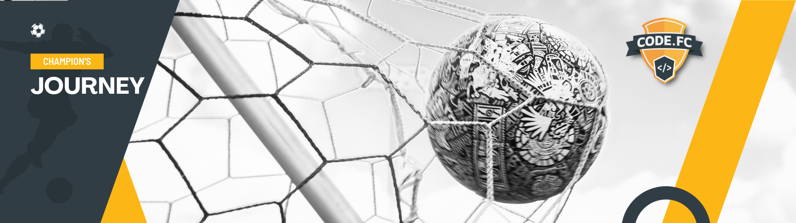
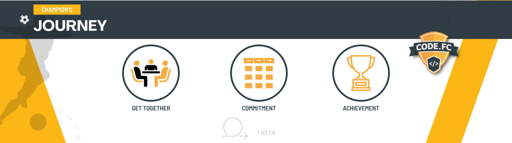

# Objective
The challenge aims to increase knowledge in processes and technologies related to cloud and DevOps.

At each stage there will be a process of immersion in knowledge from different perspectives. Having a theoretical and practical approach, with several challenges.

## Challenge 1 - Infrastructure as code

Infrastructure as Code (IaC) is widely used in several organizations with the aim of standardizing cloud infrastructure using an approach adopted in the "development world" by managing code in a Git repository and, in addition, using automation practices, such as CI (Continuous Integration) and CD (Continuous Delivery).

Through a practical approach, the following topics will be covered:

- What is infrastructure as code
- Working with Github
- Pull-Request/Code Review
- Task management
- Azure Fundamentals
- Continuous Integration
- Continuous Delivery
- Test
- GitActions
- Azure DevOps
- Network Fundamentals
- Final challenge

At the end of the challenge, it will be possible to work with the IaC model, from basic to advanced levels and adopt the best practices of large companies.

As a basis for this challenge, the Git Project will be used to manage learning activities, as well as other activities related to the final challenges.

Teste #29

# Timeline

The main objective is to immerse those involved in the challenge in real situations related to the day-to-day lives of large companies that work with technology in Brazil and around the world.

Therefore, it is very important to follow a process that takes into account 3 basic pillars:
- **Get Together:** People involved in the project must meet once during the week to align objectives and expectations, in addition to clarifying any doubts
- **Commitment:** Those involved in the project commit to the activities, prioritizing the tasks that will be developed/executed
- **Achievement:** at the end of the week, results and achievements are presented. It's time to celebrate and recap what was achieved after the first week.

Activities follow the principles each week.

